# 🚀 Domain Marketplace Platform

## 📌 Overview
A full-stack domain marketplace platform inspired by GoDaddy, built with a production-oriented architecture and real-world system design principles.

The platform allows users to search, purchase, and manage domains while ensuring secure checkout using concurrency control mechanisms. It also includes an admin dashboard for complete system monitoring and management.

---

## ⚙️ Tech Stack

- Backend: Laravel (Service Layer, Queues, Caching)
- Frontend: Vue 3 (User Interface)
- Admin Panel: Vue 3 (Admin Dashboard)
- Database: MySQL
- Authentication: Laravel Sanctum
- Caching & Queues: Redis
- External API: ResellerClub (Domain availability)

---

# 🧠 System Breakdown

---

## 🔧 Backend (Laravel API)

Designed using a clean and scalable architecture with separation of concerns.

### Key Features:
- Domain search via external API
- Secure checkout with domain locking (prevents double purchase)
- Order & payment flow handling
- Domain purchase and renewal lifecycle
- Queue-based background jobs
- Caching for performance optimization
- Logging & error handling

### Highlights:
- Concurrency-safe checkout system
- External API integration with retry handling
- Queue-based async processing
- Scalable service-based architecture

---

## 🌐 User Frontend (Vue 3)

Provides a smooth and interactive user experience for domain discovery and management.

### Features:
- Real-time domain search with availability & pricing
- Multi-domain checkout flow
- User dashboard (domains, expiry, renewals)
- Secure authentication (Sanctum)
- Clean and responsive UI

---

## 📊 Admin Panel (Vue 3)

Centralized control panel for managing platform operations.

### Features:
- User management
- Domain management
- Order tracking (paid, pending, failed)
- Revenue analytics dashboard
- Extension & pricing configuration

---

# 🏗️ Architecture

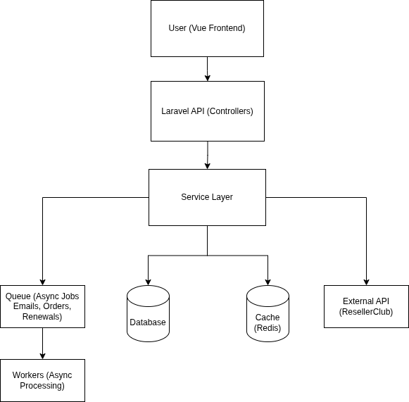

---

## 🗄️ Database Design

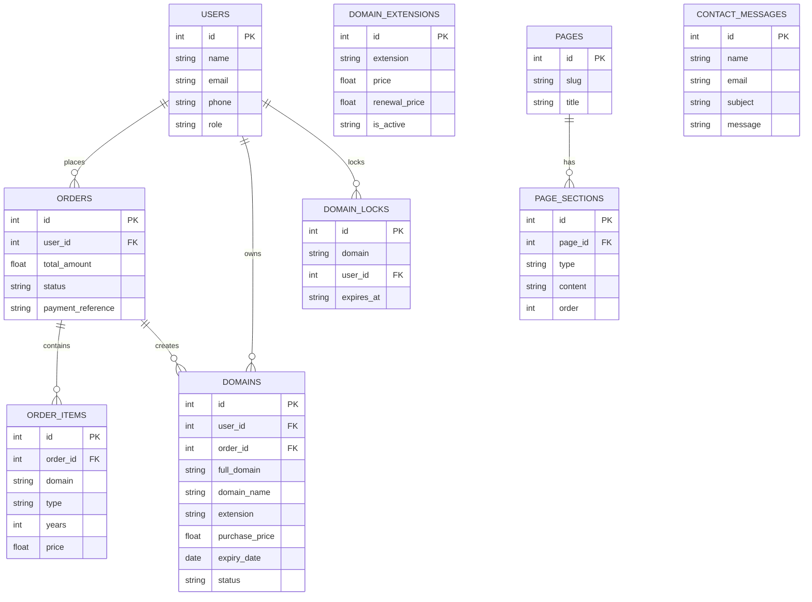
---

# 📸 Screenshots

---

## 🟢 User Frontend

### 🔍 Domain Search and Home Page
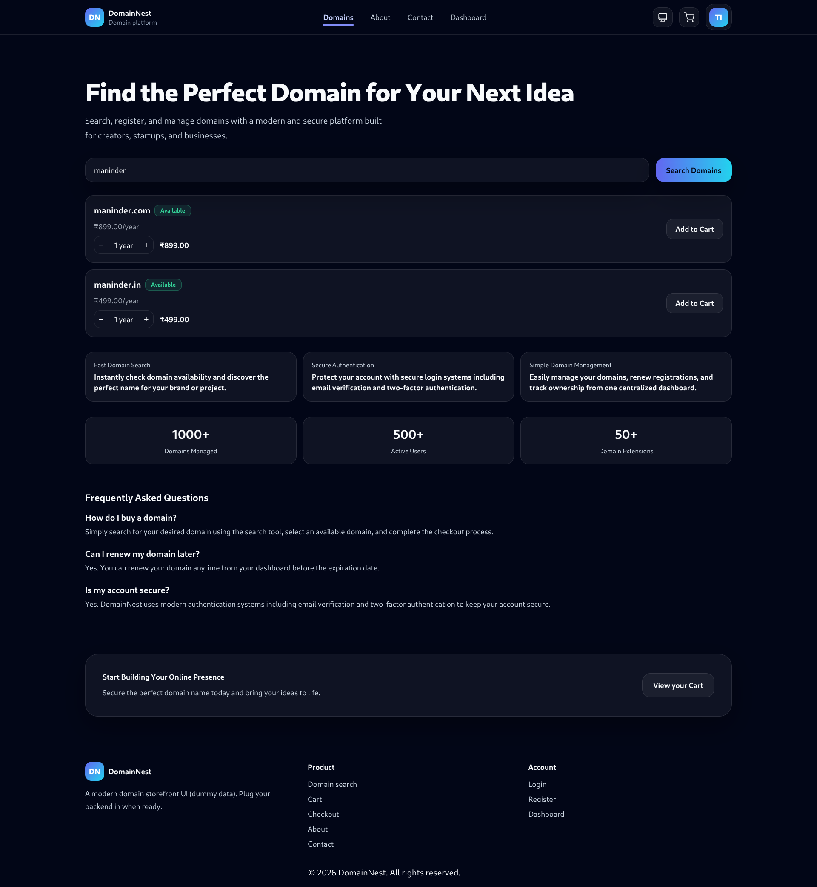

### 🛒 Cart
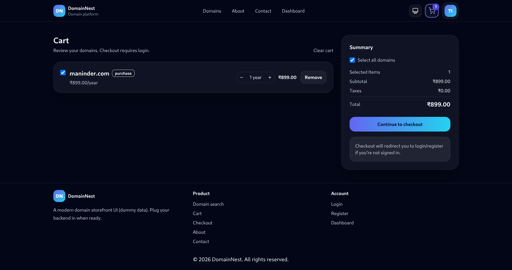

### 💳 Checkout
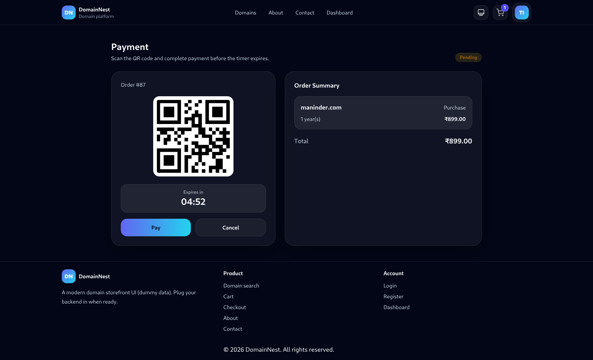

### 📊 User Domains Dashboard
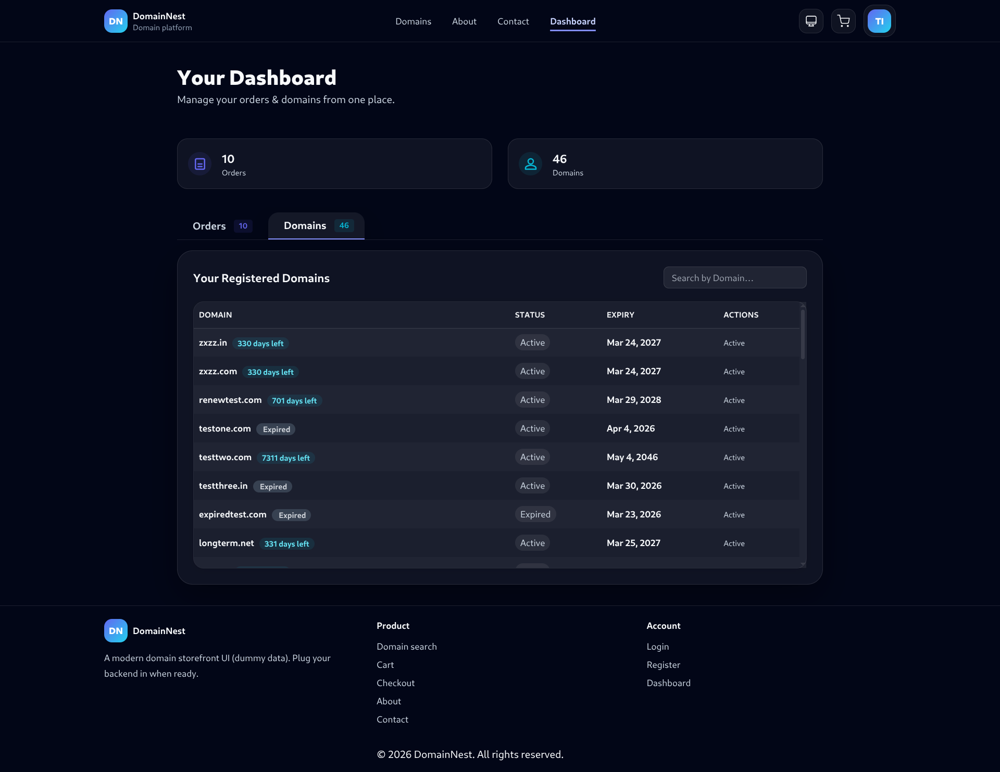

### 📦 User Orders Dashboard
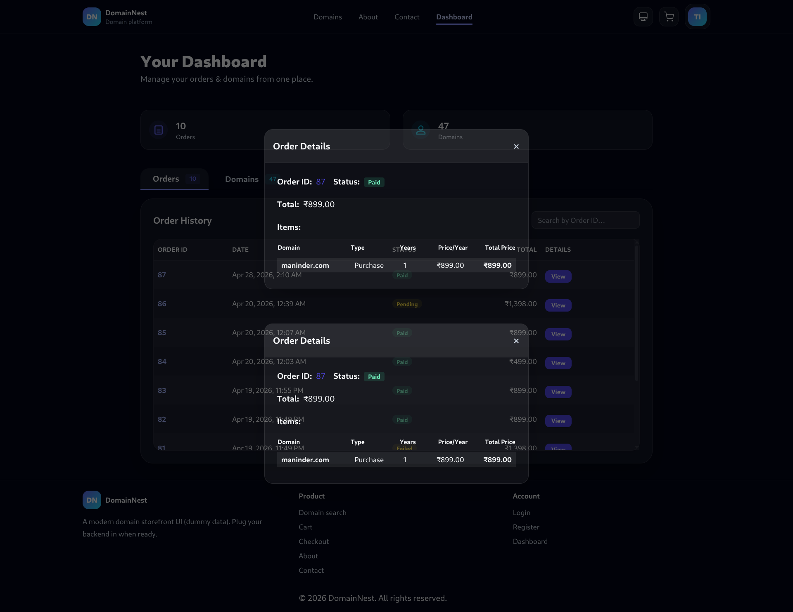

### 🔐 Login
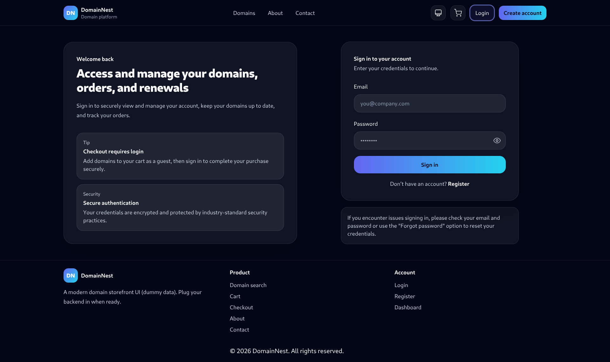

### 📧 Order Receipt Email
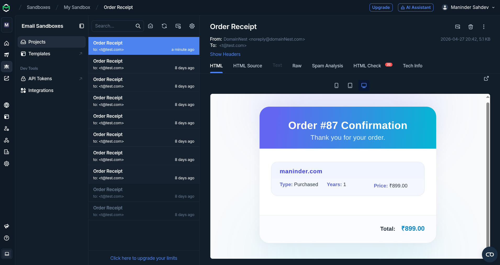

---

## 🔵 Admin Panel

### 📊 Dashboard
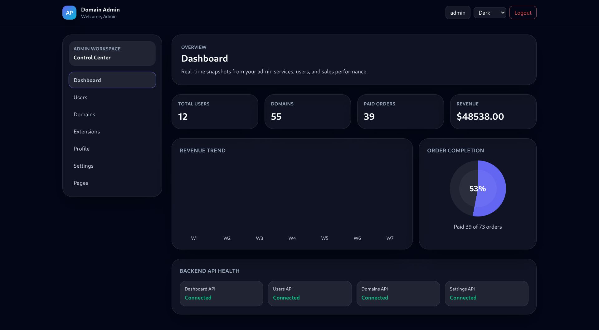

### 👥 Users
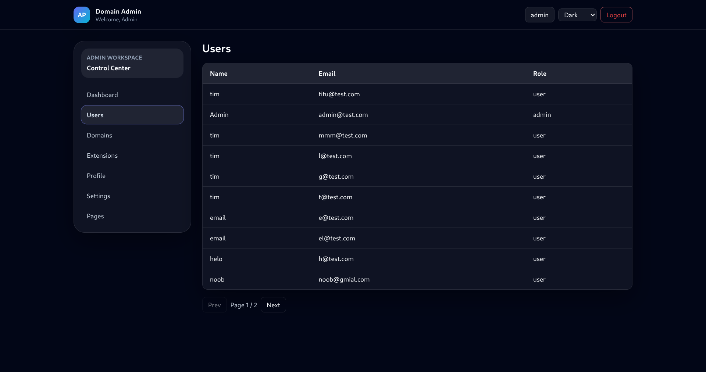

### 🌐 Domains
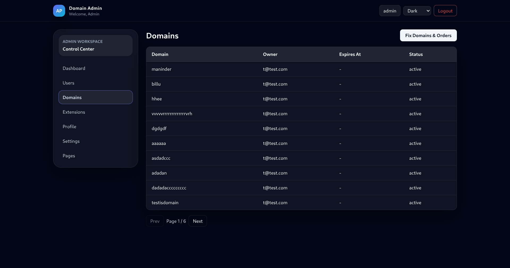

### 🧾 Pages Management
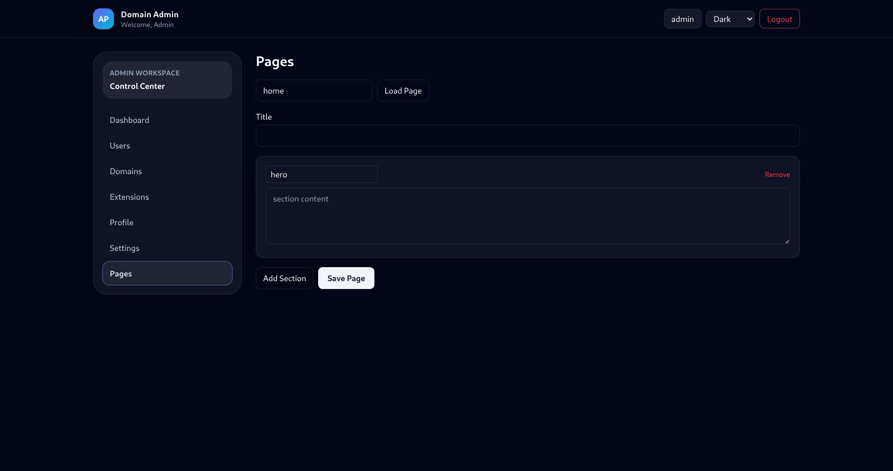

### ⚙️ Settings
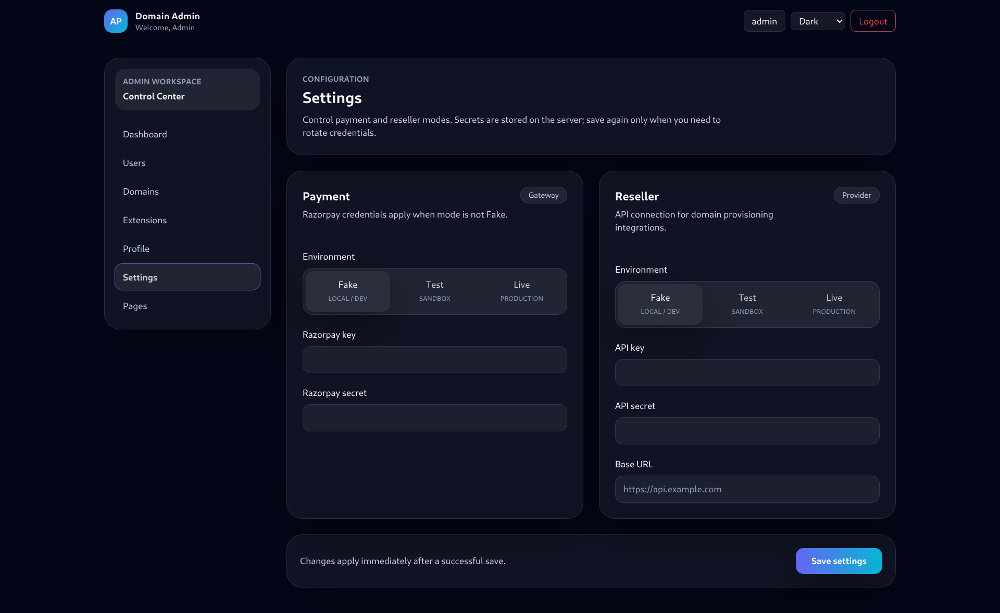

### 🧩 Domain Extensions
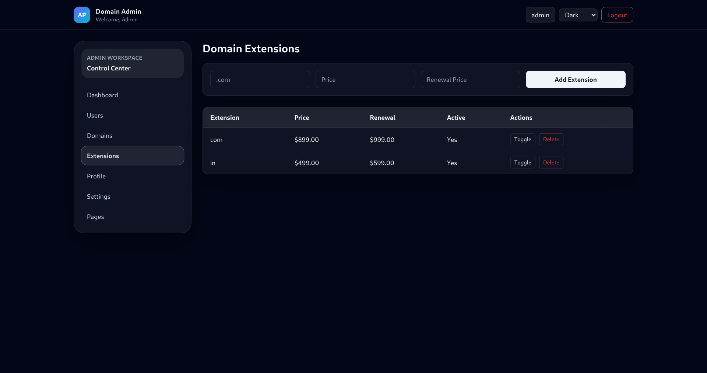

### 👤 Profile
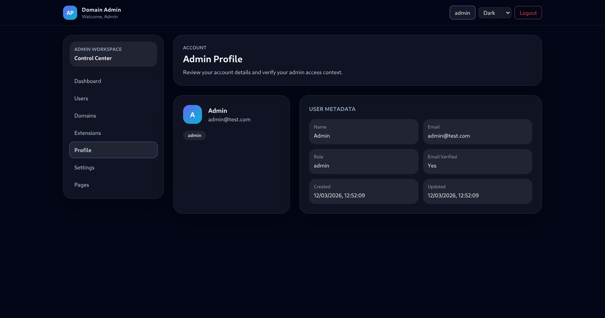

### 🔐 Admin Login
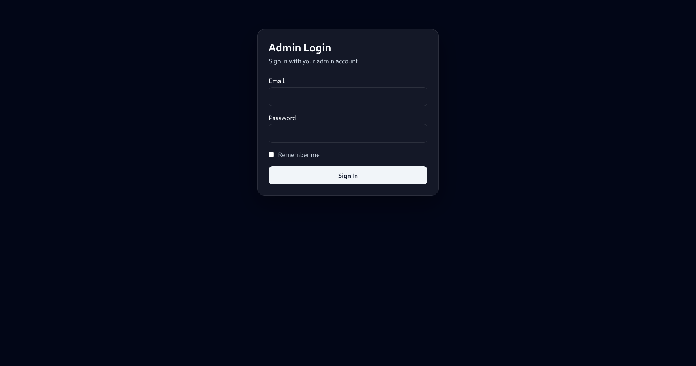

---

# 🔗 Repositories

- 🔧 Backend API  
  https://github.com/Maninder2002/domain-platform-backend/

- 🌐 User Frontend  
  https://github.com/Maninder2002/domain-platform-frontend/

- 📊 Admin Panel  
  https://github.com/Maninder2002/domain-platform-admin-frontend/

---

# 🔥 Key Engineering Highlights

- Service-based backend architecture
- Concurrency-safe checkout using domain locking
- External API integration with caching and retry logic
- Queue-based asynchronous processing
- Clean and scalable system design
- Production-ready error handling and logging

---

# 🎯 Conclusion

This project was built to simulate a real-world domain marketplace and helped me move beyond basic CRUD development into solving actual engineering problems.

While building this system, I focused on handling practical challenges like concurrency (domain locking during checkout), external API integration, and maintaining data consistency across the order and payment flow. I also worked on structuring the backend in a scalable way using services, queues, and caching.

On the frontend side, I aimed to keep the experience simple and functional, making it easy for users to search, purchase, and manage domains, while also building an admin panel to monitor and control the system.

Overall, this project reflects my approach as a developer — not just writing code, but thinking about reliability, edge cases, and how a system behaves in real scenarios.

