# Domain Marketplace Platform

## Overview

This project is a full-stack domain marketplace inspired by platforms like GoDaddy. It allows users to search, purchase, renew, and manage domains while providing administrators with the tools required to manage users, pricing, orders, and website content.

The project was built with a strong focus on real-world backend engineering rather than basic CRUD functionality. During development, I worked on solving practical challenges such as preventing concurrent domain purchases, integrating with third-party APIs, processing background jobs, improving performance through caching, and maintaining a clean and scalable architecture.

---

## Technology Stack

| Layer          | Technologies     |
| -------------- | ---------------- |
| Backend        | Laravel          |
| User Frontend  | Vue 3            |
| Admin Panel    | Vue 3            |
| Database       | MySQL            |
| Authentication | Laravel Sanctum  |
| Cache & Queue  | Redis            |
| External API   | ResellerClub API |

---

# Project Structure

## Backend (Laravel API)

The backend follows a service-oriented architecture that separates business logic from controllers, making the application easier to maintain, test, and extend.

### Features

* Search domain availability through the ResellerClub API
* Secure checkout with Redis-based domain locking
* Domain purchase and renewal workflow
* Order and payment management
* Queue-based background job processing
* Redis caching for improved performance
* Centralized logging and error handling

### Engineering Highlights

* Implemented concurrency-safe checkout using Redis locks to prevent multiple users from purchasing the same domain simultaneously.
* Integrated external APIs with retry handling to improve reliability.
* Used Laravel queues for asynchronous processing of long-running operations.
* Structured the backend using a service layer for better separation of concerns and maintainability.

---

## User Frontend (Vue 3)

The customer-facing application provides a straightforward experience for searching, purchasing, and managing domains.

### Features

* Real-time domain search with availability and pricing
* Shopping cart and checkout flow
* User dashboard for purchased domains
* Order history
* Secure authentication with Laravel Sanctum
* Responsive user interface

---

## Admin Panel (Vue 3)

The administration dashboard provides centralized tools for monitoring and managing the marketplace.

### Features

* User management
* Domain management
* Order monitoring
* Revenue dashboard
* Domain extension and pricing management
* Website page management

---

# Architecture

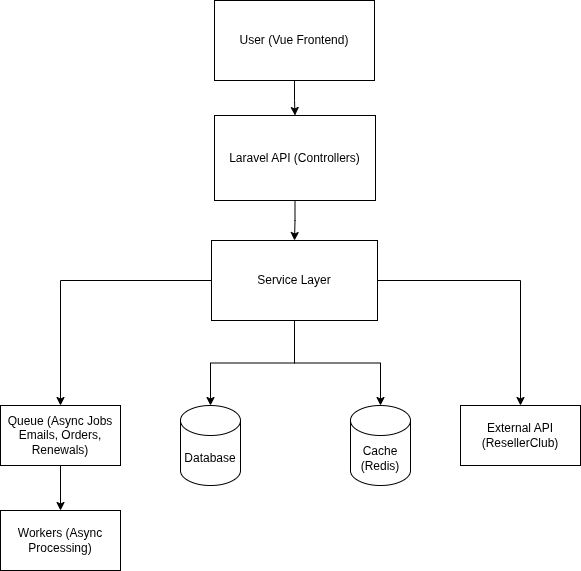

---

## Database Design

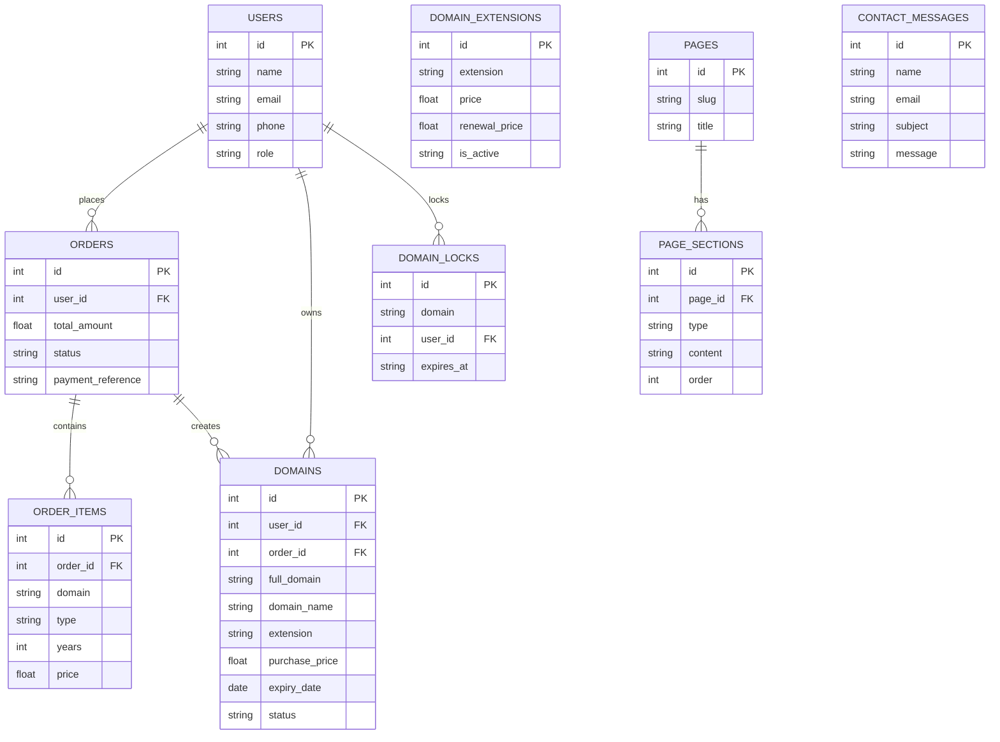
```mermaid
erDiagram

    USERS {
        int id PK
        string name
        string email
        string phone
        string role
    }

    ORDERS {
        int id PK
        int user_id FK
        float total_amount
        string status
        string payment_reference
    }

    ORDER_ITEMS {
        int id PK
        int order_id FK
        string domain
        string type
        int years
        float price
    }

    DOMAINS {
        int id PK
        int user_id FK
        int order_id FK
        string full_domain
        string domain_name
        string extension
        float purchase_price
        date expiry_date
        string status
    }

    DOMAIN_EXTENSIONS {
        int id PK
        string extension
        float price
        float renewal_price
        string is_active
    }

    DOMAIN_LOCKS {
        int id PK
        string domain
        int user_id FK
        string expires_at
    }

    PAGES {
        int id PK
        string slug
        string title
    }

    PAGE_SECTIONS {
        int id PK
        int page_id FK
        string type
        string content
        int order
    }

    CONTACT_MESSAGES {
        int id PK
        string name
        string email
        string subject
        string message
    }

    USERS ||--o{ ORDERS : places
    USERS ||--o{ DOMAINS : owns
    USERS ||--o{ DOMAIN_LOCKS : locks

    ORDERS ||--o{ ORDER_ITEMS : contains
    ORDERS ||--o{ DOMAINS : creates

    PAGES ||--o{ PAGE_SECTIONS : has
```

---

# Screenshots

## User Frontend

### Home Page & Domain Search

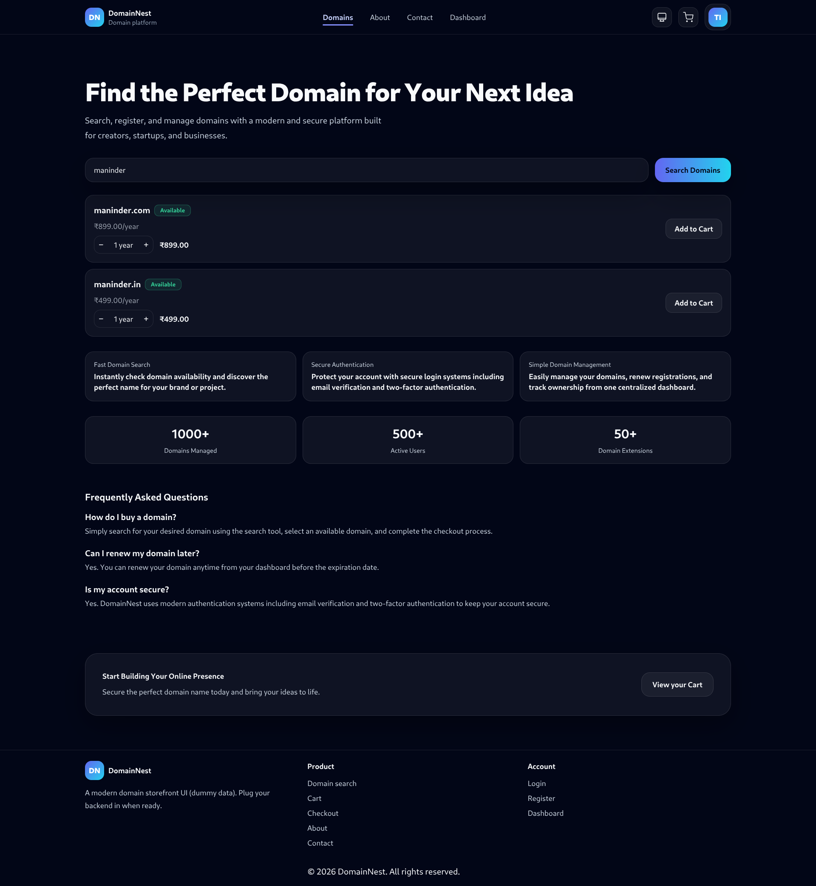

### Shopping Cart

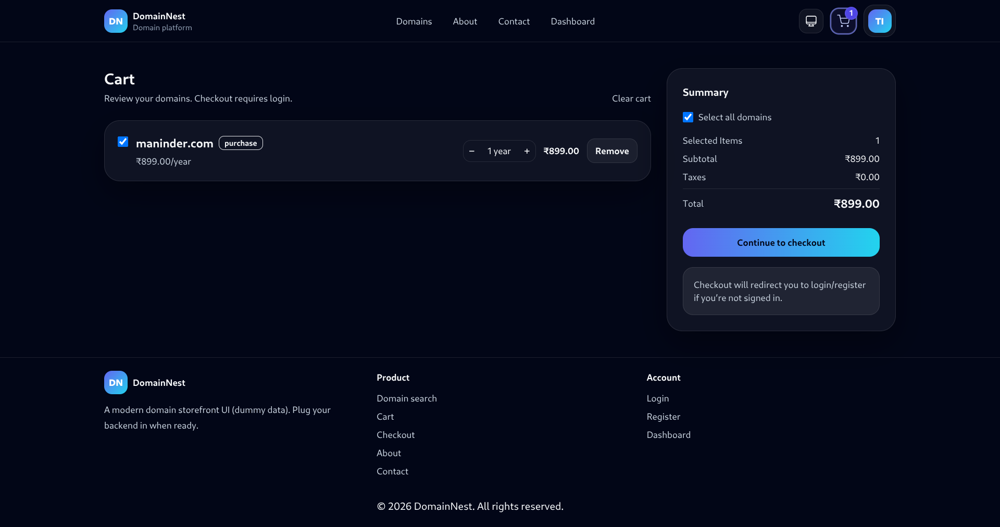

### Checkout

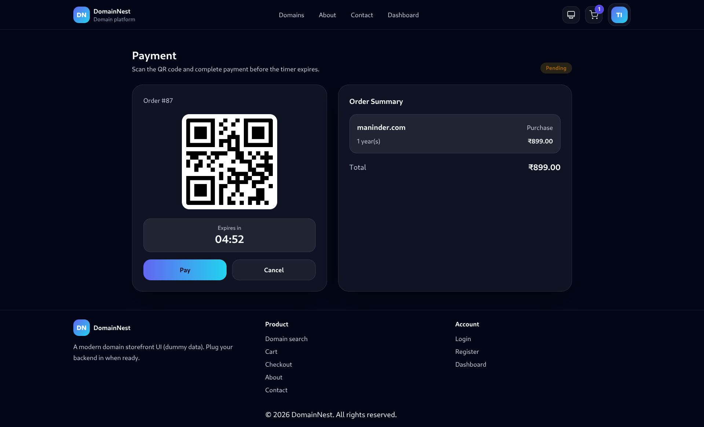

### User Dashboard

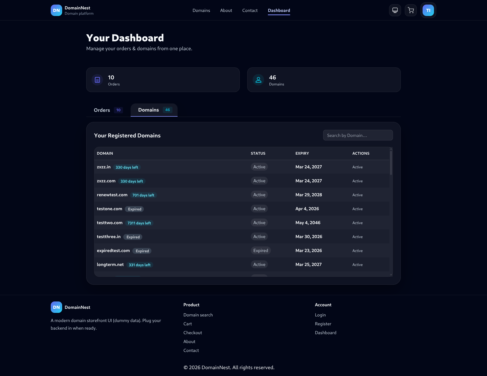

### Order History

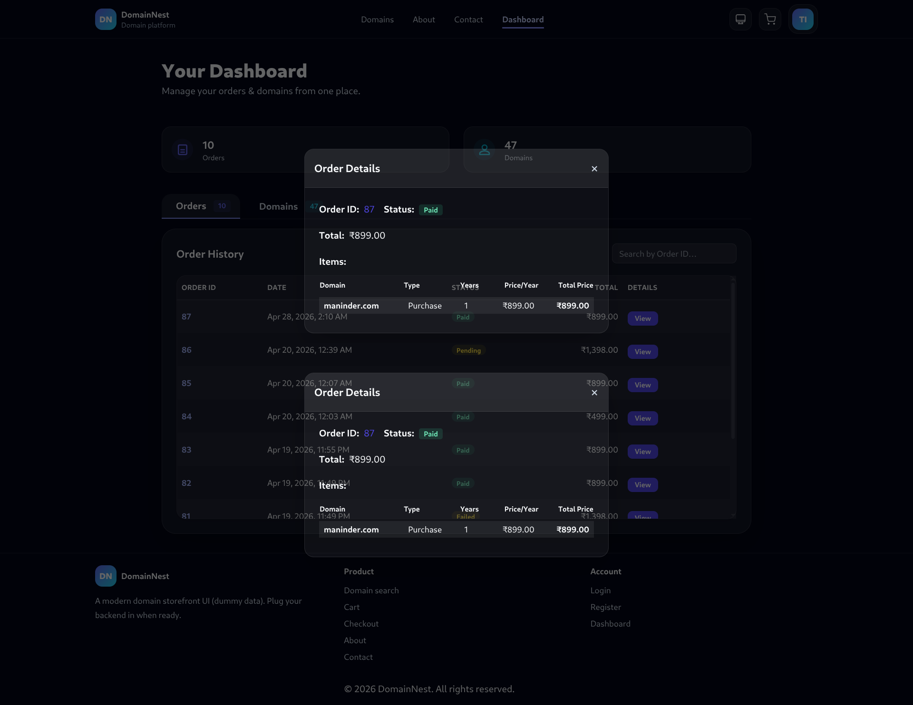

### Login

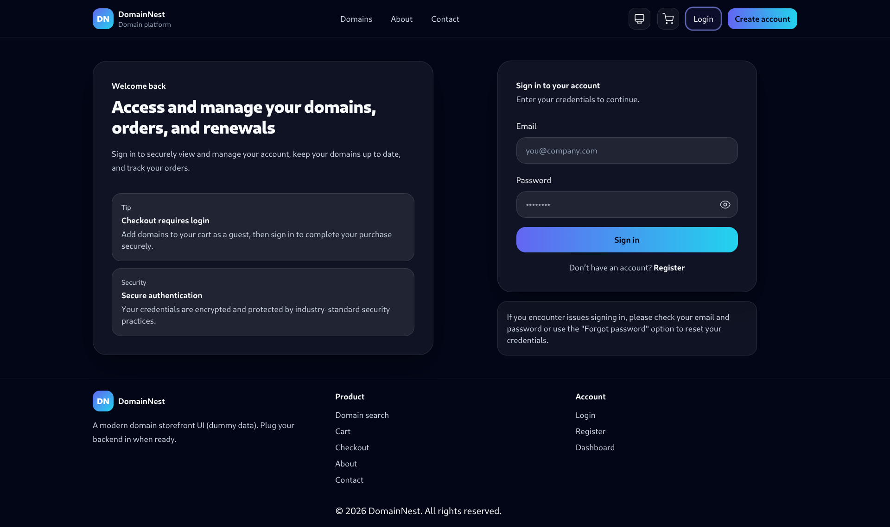

### Order Receipt Email

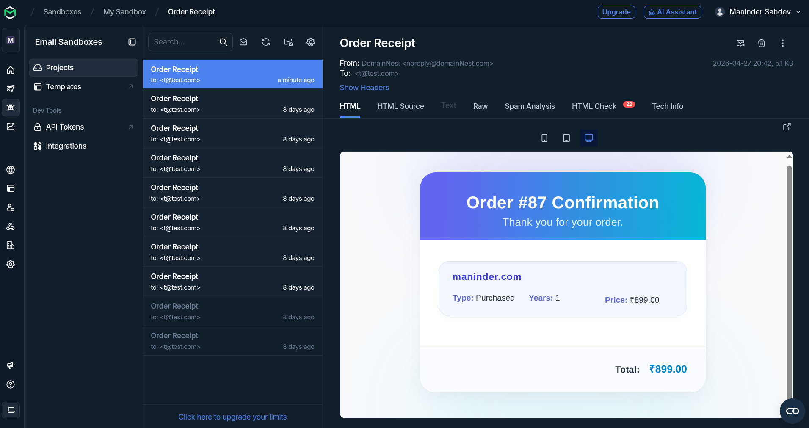

---

## Admin Panel

### Dashboard

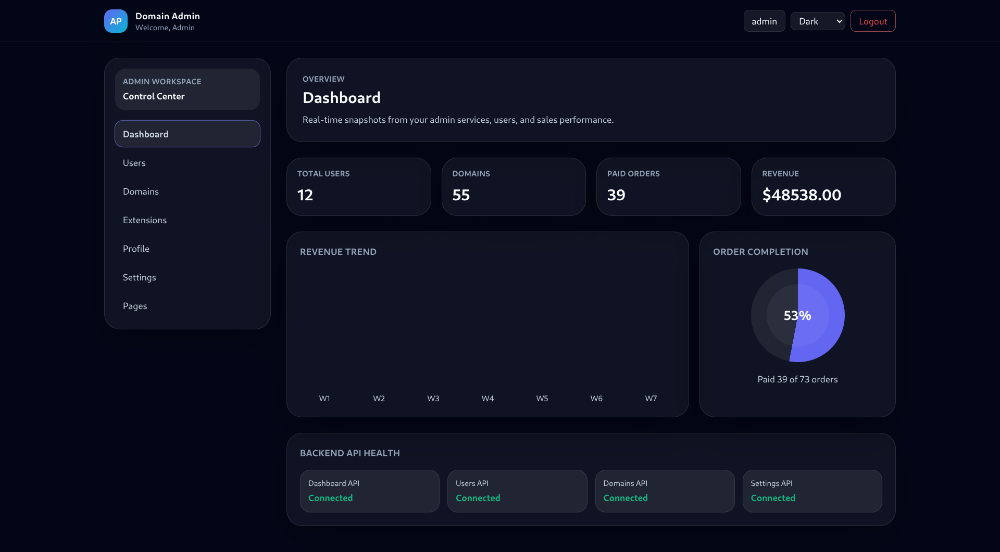

### User Management

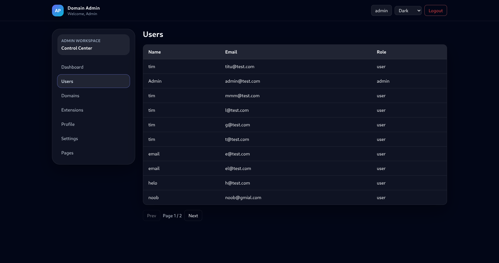

### Domain Management

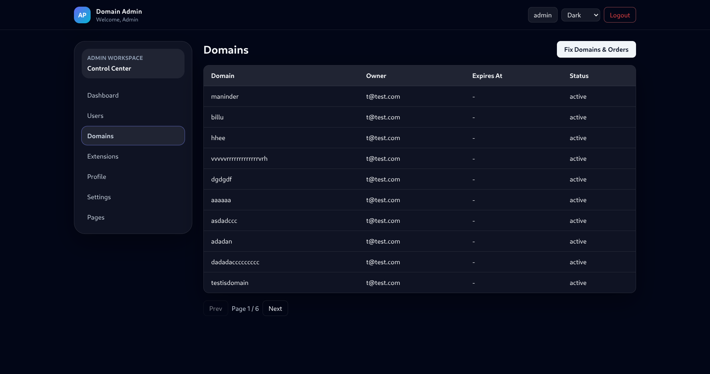

### Website Pages

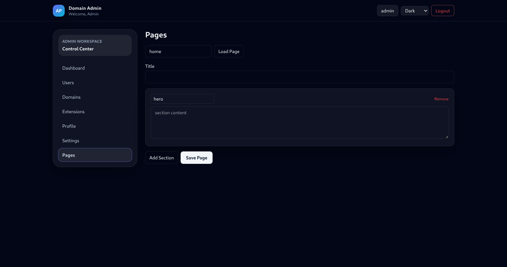

### Settings

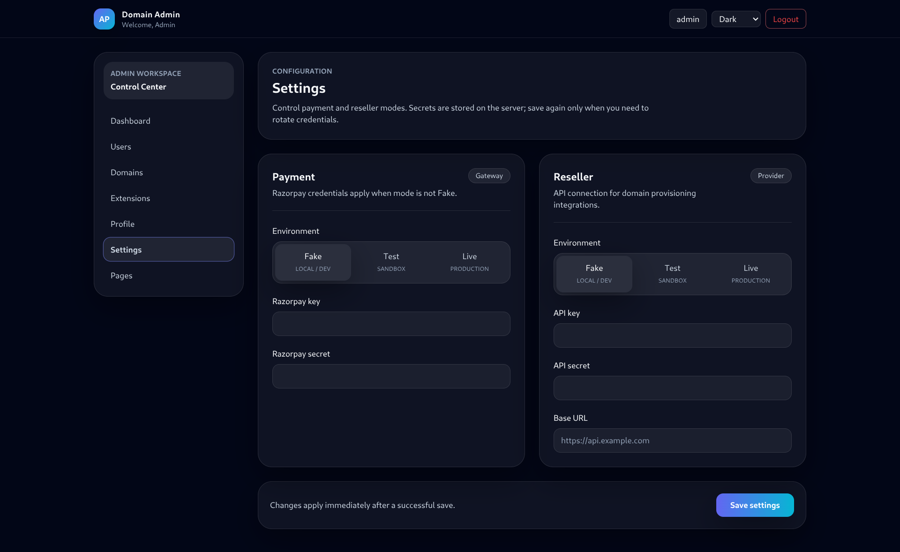

### Domain Extensions

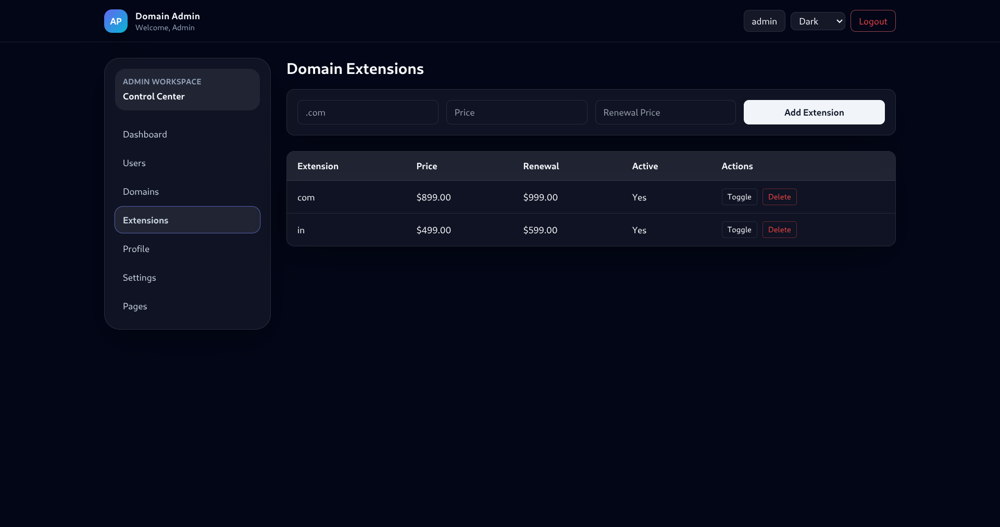

### Profile

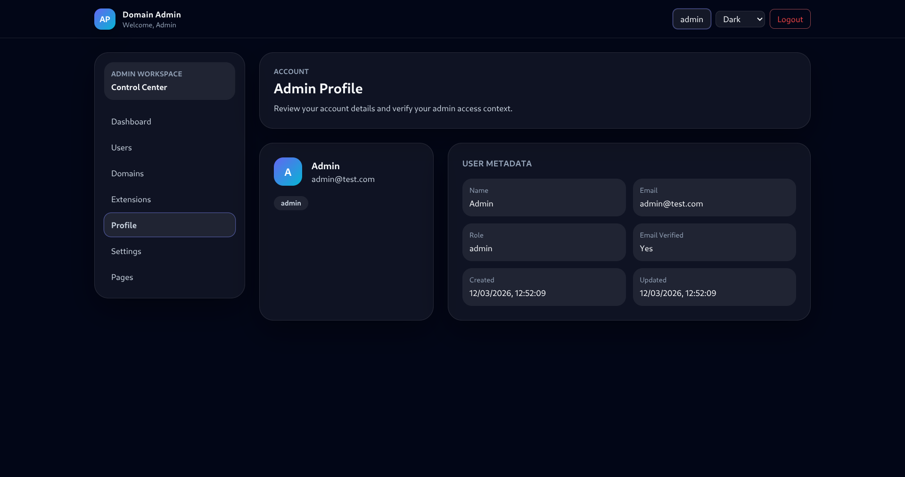

### Admin Login

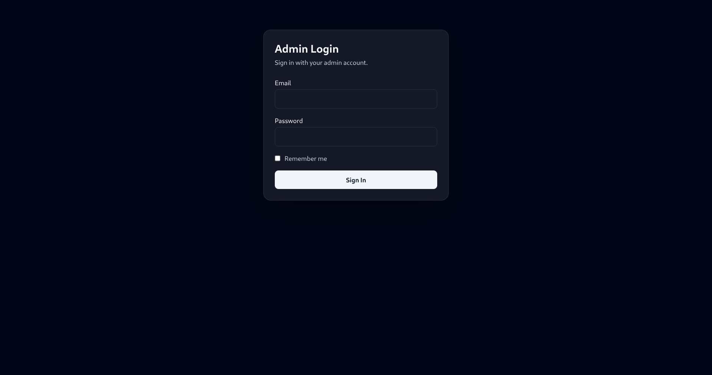

---

# Repositories

### Backend API

https://github.com/Maninder2002/domain-platform-backend/

### User Frontend

https://github.com/Maninder2002/domain-platform-frontend/

### Admin Panel

https://github.com/Maninder2002/domain-platform-admin-frontend/

---

# Engineering Highlights

* Built a service-oriented Laravel backend with clear separation between controllers and business logic.
* Implemented Redis-based locking to prevent concurrent purchases of the same domain during checkout.
* Integrated the ResellerClub API with retry handling and caching to improve reliability and reduce unnecessary requests.
* Used Laravel queues to process long-running operations asynchronously.
* Applied Redis caching to improve response times and reduce external API calls.
* Designed the application with scalability, maintainability, and production-oriented practices in mind.

---

# What I Learned

Building this project helped me move beyond creating traditional CRUD applications and focus on solving problems commonly encountered in production systems.

One of the most interesting challenges was handling concurrent purchases. Since a domain can only be purchased once, I implemented Redis-based locking to ensure multiple users could not complete checkout for the same domain simultaneously. Working on this feature gave me practical experience with race conditions and data consistency.

The project also introduced me to integrating third-party APIs, processing background jobs with queues, improving performance through caching, and organizing backend code using a service-oriented architecture.

On the frontend, I focused on creating a simple and responsive experience for users while building a separate administrative interface to manage the marketplace efficiently.

Overall, this project strengthened my understanding of designing reliable systems, writing maintainable code, and building applications that address real-world engineering challenges.
